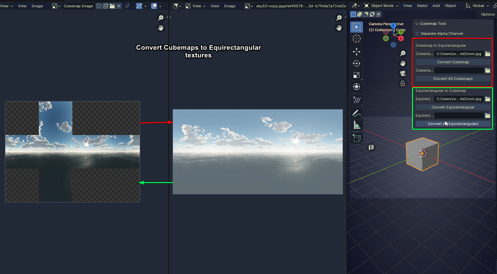

# BlenderCubemapConverter
Blender Addon for Converting cubemaps using py360converter library

Huge credit to Py360Convert GitHub page for the libraries needed for this to work with python:
https://github.com/sunset1995/py360convert

# Note 
You do not need to manually install py360convert anymore like the video below suggets. Just install and play.
When enabling the addon for the first time it will automatically download scipy and numpy dependencies, this may take a minute or two.

# Video tutorial:
https://youtu.be/dpMQr59vSys

# Changes Added
- Checkbox for Separating Alpha into additonal RGB image in case you want it as a different RGB image (used in my current Halo projects)
- Removed manual py360 installation process
- Supports most image formats now including HDR
- Convert between Cubemap <=> equirectangular
